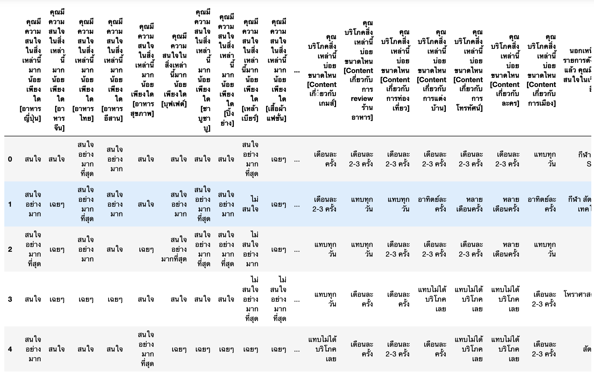
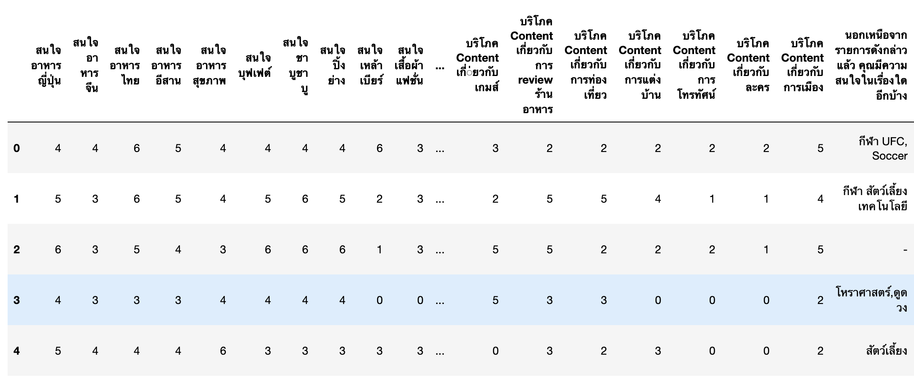
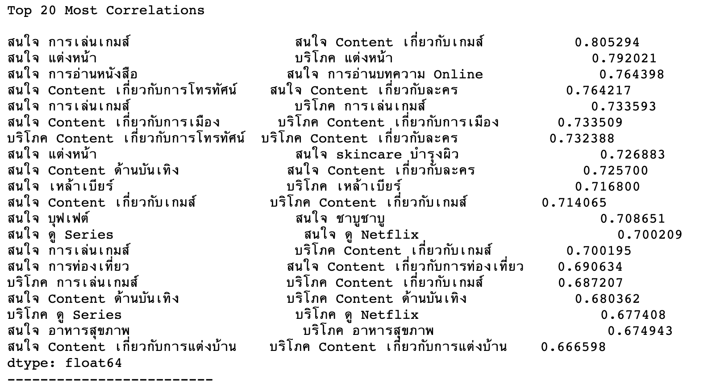
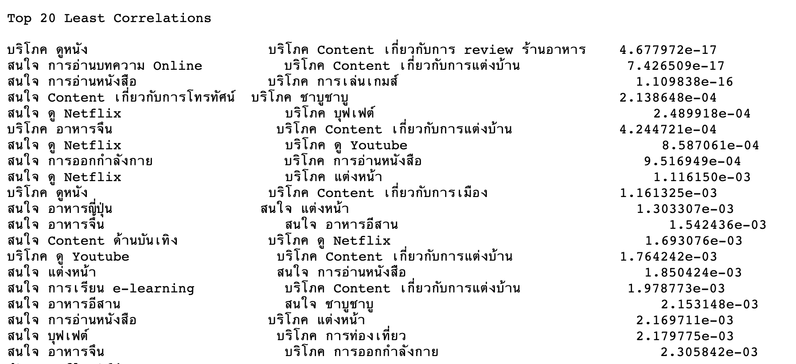
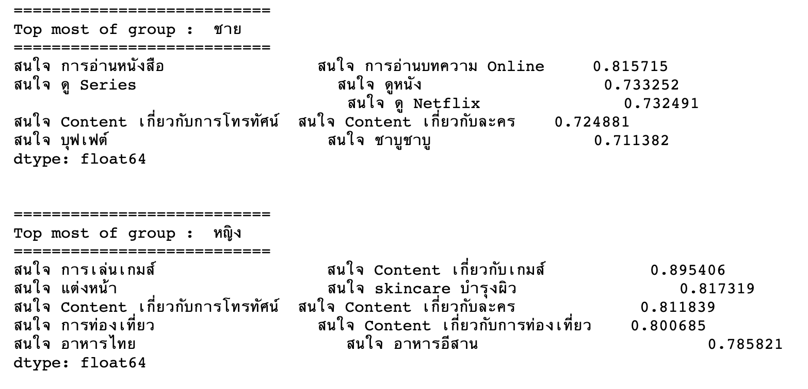
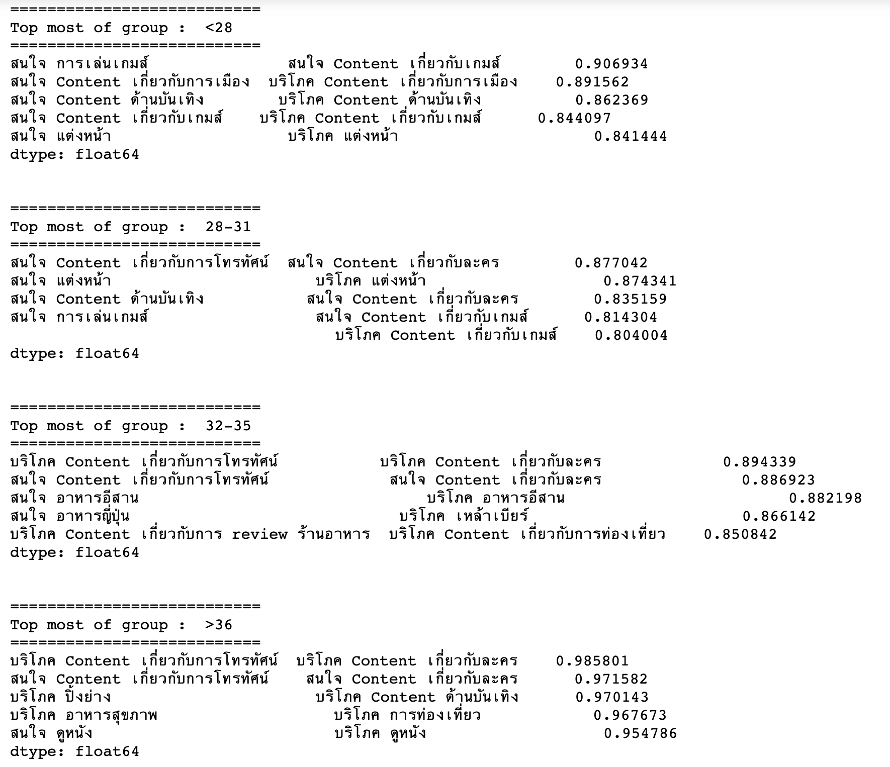

# Homework 01 - Analysis of customer behaviors

## รายละเอียด
งานนี้เป็นการวิเคราะห์ข้อมูลจากแบบสอบถามของนักศึกษาในห้องจำนวน 63 คน โดยคำถามที่ใช้สอบถามเป็นเรื่องเกี่ยวกับคนสนใจและการบริโภคในหัวข้อต่างๆ ตัวอย่างเช่น

คุณมีความสนใจในสิ่งเหล่านี้มากน้อยเพียงใด [อาหารญี่ปุ่น]
คุณมีความสนใจในสิ่งเหล่านี้มากน้อยเพียงใด [เสื้อผ้าแฟชั่น]
คุณบริโภคสิ่งเหล่านี้บ่อยขนาดไหน [Content เกี่ยวกับการ review ร้านอาหาร]
คุณบริโภคสิ่งเหล่านี้บ่อยขนาดไหน [Content เกี่ยวกับการแต่งบ้าน]

ส่วนคำตอบจะเป็นหัวข้อให้เลือก 6-7 หัวข้อเป็นลักษณะ Likert Scale คือ
ถ้าเป็นคำถามเกี่ยวกับความสนใจจะมีคำตอบให้เลือกดังนี้
a) ไม่สนใจอย่างมากที่สุด
b) ไไม่สนใจอย่างมาก
c) ไไม่สนใจ
d) ไเฉยๆ
e) ไสนใจ
f) ไสนใจอย่างมาก
g) ไสนใจอย่างมากที่สุด

ถ้าเป็นคำถามเกี่ยวกับการบริโภคจะมีคำตอบให้เลือกดังนี้
a) แทบไม่ได้บริโภคเลย
b) หลายเดือนครั้ง
c) เดือนละ 2-3 ครั้ง
d) เดือนละครั้ง
e) อาทิตย์ละครั้ง
f) แทบทุกวัน

และมีอีก 1 คำถามที่ถามว่า 
"นอกเหนือจากรายการดังกล่าวแล้ว คุณมีความสนใจในเรื่องใดอีกบ้าง"
แล้วให้นักศึกษาตอบเป็นลักษณะข้อความอะไรก็ได้

จากนั้นก็ให้นักศึกษาทำการวิเคราะห์ด้วยวิธีอะไรก็ได้เพื่อทำการหา Insight จากข้อมูลชุดนี้

## ลักษณะของข้อมูลที่นำมาใช้ในการวิเคราะห์

## ทำการ Data Preparation
โดยการ Cleansing ข้อมูลต่างๆ และทำการเปลี่ยนคำตอบให้กลายเป็นข้อมูลตัวเลขเพื่อใช้ในการวิเคราะห์ ผลที่ได้ก็จะได้ดังนี้

## ทำการวิเคราะห์ด้วย Pearson Correlation
ในงานนี้จะวิเคราะห์โดยใช้เครื่องมือทางสถิติคือ Pearson Correlation ซึ่ง Pearson Correlation เป็นการวิเคราะห์ความสัมพันธ์ระหว่างตัวแปรสองตัว ผลที่ได้จะเป็นค่าที่เรียกว่าสัมประสิทธิ์สหสัมพันธ์ ซึ่งมีค่าตั้งแต่ -1 ถึง 1 วิธีการตีความคือถ้าผลที่ได้มีค่าเข้าใกล้ 1 แสดงว่าแปรทั้งคู่มีความสัมพันธ์กันมาก
แต่ถ้าเข้าใกล้ 0 แสดงว่ามีความสัมพันธ์กันน้อย ส่วนเครื่องหมายบวกลบแสดงทิศทางของความสัมพ้นธ์นั่นคือถ้าเป็นเครื่องหมายบวก แสดงว่าความสัมพันธ์ของตัวแปรทั้งสองไปในทิ้ศทางเดียวกัน แต่ถ้ามีเครื่องหมายเป็นลบแสดงว่าความสัมพันธ์
ของทั้ง 2 ตัวแปรเป็นไปในทิศทางที่ตรงกันข้ามกันเป็นต้น

## ความสัมพันธ์ที่เป็น ​Top most
จากข้อมูลก็พบคนที่สนใจเรื่องไหนก็มักจะบริโภคสิ่งนั้น เช่นสนใจเล่นเกมส์ก็จะบริโภคเนื้อหาเกี่ยวกับเกมส์
ที่น่าสนใจคือถ้าคนสนใจเกี่ยวกับโทรทัศน์ ก็จะเลือกดูละคร หรือถ้าคนสนใจซีรียส์ก็จะสนใจ Netflix ด้วยทั้งๆ ที่ Netflix พึ่งจะเข้ามาได้ไม่กี่ปีแต่ก็เข้ามามีอิทธิพลกับนักศึกษาระดับปริญญาโทได้พอสมควร

## ความสัมพันธ์ที่เป็น ​Top least
ลองมาดู Insight ที่ได้จากสิ่งที่ไม่เกี่ยวข้องกัน ก็จะพบอะไรที่น่่าสนใจเหมือนกันเช่น
คนที่สนใจ Netflix จะไม่กินบุฟเฟต์ซึ่งอาจเนื่องจากต้องออกไปกินนอกบ้าน ดังนั้นถ้าเราพิสูทธ์ได้ว่าสมมุติฐานนี้จริงกับ ก็จะมีประโยชน์ทางธุรกิจคือมี Netflix ให้ดูในร้านบุฟเฟต์ได้ 
หรืออีกเรื่องหนึ่งคือคนสนใจออกกำลังกาย จะไม่อ่านหนังสือ ดังนั้นถ้าเราจะโปรโมทให้คนรักการออกกำลังกาย การจะไปโปรโมทในนิตยสารก็อาจจะไม่ประสบความสำเร็จเป็นต้น

## ความสัมพันธ์ที่เป็น ​Top most ในมุมมองของเพศ
เมื่อมาดูในมุมมองของความต่างระหว่างเพศก็พบว่า นักศึกษาผู้ชายชอบอ่านหนังสือมากที่สุดส่วนนักศึกษาผู้หญิงชอบเล่นเกมส์มากที่สุด ถ้านำ Insight นี้ไปเชื่อมโยงกับผลการเรียนก็อาจจะได้ คำตอบอะไรบางอย่างได้
ถ้ากล่าวโดยสรุปพบว่า
ผู้ชายชอบ อ่านหนังสือ ดูหนัง และกินชาบูชาบู
ส่วนผู้หญิงชอบ เล่นเกมส์ แต่งหน้า ท่องเที่ยว แต่ถ้าเรื่องกินจะชอบอาหารอีสานอาจจะเนื่องจากกลัวความอ้วนก็ได้ แต่จะเห็นว่าผู้หญิงจะเน้นบันเทิงและรักสวยรักงามเป็นหลัก

## ความสัมพันธ์ที่เป็น ​Top most ในมุมมองช่วงอายุ
สำหรับ Insight ในมุมมองของช่วงอายุจะพย Insight ว่า
นักศึกษอายุต่ำกว่า 28 สนใจการเมือง ซึ่งน่าจะตอบอะไรบางอย่างได้ซึ่งสอดคล้องกับสถานะการณ์ของประเทศ
นักศึกษากลุ่มวัยทำงาน 32-35 จะสนใจบริโภคเหล้าเบียร์ อาจจะเนื่องจากคนกลุ่มนี้เริ่มจะเป็นระดับ Senior และผู้บริหาร ซึ่งต้องแบกรับความเครียสและต้องสังสรรค์ตามหน้าที่ตำแหน่งงานก็เป็นได้
ส่วนคนกลุ่มอายุสูงขึ้นมักจะต้องการบริโภคเกี่ยวกับบันเทิงและสุขภาพเป็นหลักอาจเนื่องจากมีการเก็บเงินได้พอสมควร และตำแหน่งงานเริ่มจะคงตัวแล้วก็เป็นได้

