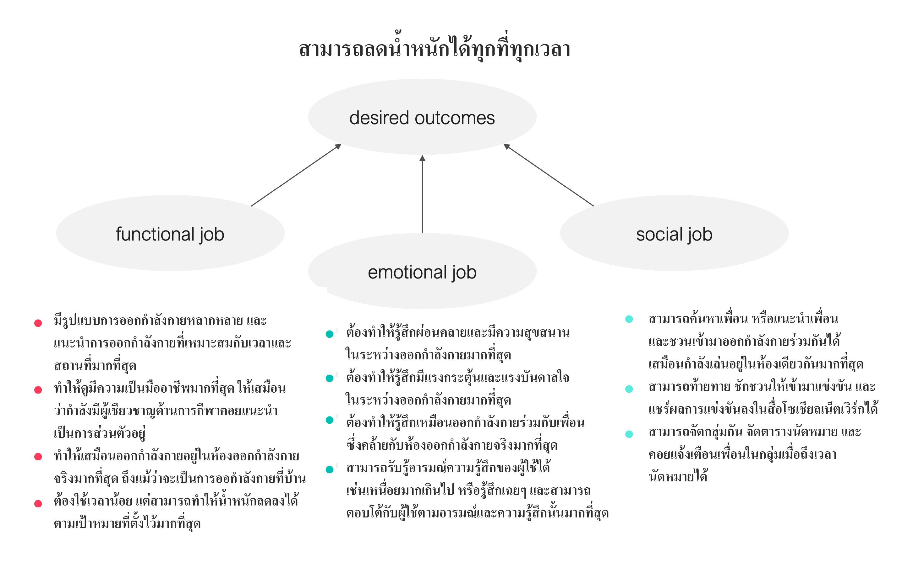

# Homework 02 - Jobs to be done

## รายละเอียด
เป็นการตั้งเป้าหมายสิ่งที่เราต้องการที่จะทำ ซึ่งมีข้อความเป้าหมายที่ตั้ง (Job Statement) จะมีรูปแบบประกอบด้วย 3 ส่วนคือ Verb ตามด้วย Object of Control และปิดท้ายด้วย Context ตัวอย่างเช่น Listen + to music + in my home เป็นต้น จากนั้นให้หาผลลัพธ์ที่ต้องการในด้าน Function ด้าน Emotion และด้าน Social ซึ่ง Job to be Done ที่ได้นั้นก็จะแสดงดังรูป

## ลักษณะของข้อมูลที่นำมาใช้ในการวิเคราะห์

## ความเชื่อมโยง
งานนี้ออกแบบให้มีความเชื่อมโยงไปถึงอีก 2 Homework ข้างล่างโดย
ใน Homework ที่ 3 ต้องการที่จะโยงให้เห็นว่าสาเหตุที่เราต้องการทำ Job นี้ให้สำเร็จ เพราะเรามี Pain และมี Gain อะไร และเราจะหา Product อะไรที่จะทำให้เรา Gain สิ่งที่เราต้องการ และทำให้ Pain ที่เกิดขึ้นหายไป
ใน Homework ที่ 12 ก็จะเป็นการคิดภาคต่อของ Homework ที่ 3 ว่าเราจะสร้าง Product นั้นให้เป็นรูปเป็นร่างได้ได้อย่างไร โดยนำหลักการของ ​Design Thinking มาใช้

- [x] Homework 03 - Value Proposition
(../Homework%2003%20-%20Value%20Proposition)

- [x] Homework 12 - Design Thinking
(../Homework%2012%20-%20Design%20Thinking)