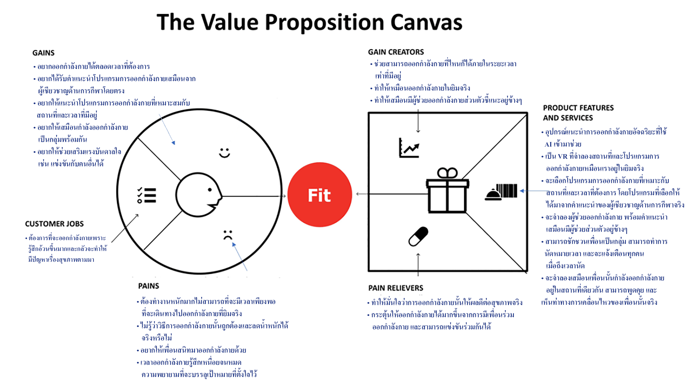

# Homework 03 - Value Proposition

## รายละเอียด
ในงานนี้เกิดจากการที่ให้เพื่อนๆ ในห้องทำการระบุว่าใน 1 วันนับตั้งแต่เช้าเมื่อมีการตื่นนอนจนกระทั่งนอนหลับนั้นได้ทำอะไรลงไปบ้าง และในแต่ละกิจกรรมที่ทำนั้นมี Pain และมี Gain อะไรเกิดขึ้นโดยบันทึกลงในไฟล์ excel เพื่อนำไปใช้ในการวิเคราะห์หา Value Proposition นั่นคือการหาคุณค่าที่ส่งมอบให้ลูกค้า
วิธีการที่จะหา Value Proposition ในงานนี้ จะทำโดยหาว่าลูกค้าต้องการอะไร เขามี Gain ที่อยากได้อะไร และเขามี Pain เกี่ยวกับเรื่องอะไร หลังจากนั้นก็จะมาพิจารณาว่าเราจะสร้างสินค้าอะไรที่จะตอบสนอง Gain และลด Pain ของเขาได้และทำได้อย่างไร
สำหรับในงานนี้จะไม่ได้เอา Pain และ Gain ของทุกคนมาใช้ แต่จะเอา Pain และ Gain ของตัวเองมาทำการวิเคราะห์แล้ววาดบน Framework ที่ชื่อว่า Value Proposition Canvas สาเหตุที่ทำเช่นนี้เนื่องจากต้องการที่จะวิเคราะห์จากจุดเล็กๆ นั่นคือตัวเราให้ดีเสียก่อนแล้วค่อยขยายเนื้อหาให้มากขึ้นไปในอนาคต

## ลักษณะของ Value Proposition Canvas ที่ได้เป็นดังนี้

## งานนี้เป็นงานภาคต่องจาก 2 งานข้างล่างคือ
- [x] [Homework 02 - Jobs to be done](../Homework%2002%20-%20Jobs%20to%20be%20done)

- [x] [Homework 12 - Design Thinking](../Homework%2012%20-%20Design%20Thinking)