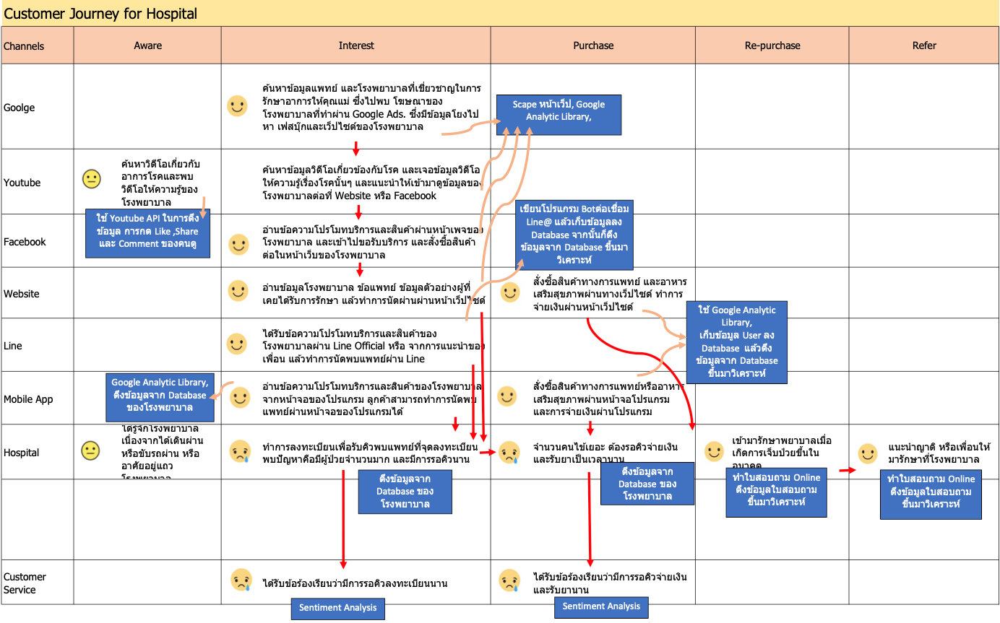
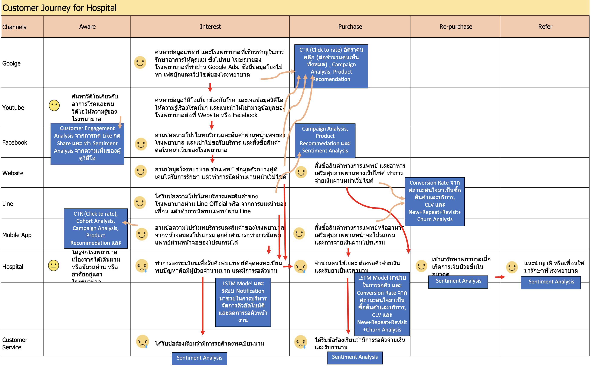

# Homework 04 - Customer Journey

## รายละเอียด
งานนี้ให้ทำการเขียนแสดงเส้นทางของลูกค้าตั้งแต่เริ่มเห็นบริการของเราหรือสินค้าของเราจนกระทั่งจบกระบวนการทั้งหมด จากนั้นให้ทำการวิเคราะห์ว่า ในแต่ละจุดจะทำการวิเคราะห์ข้อมูลด้วยวิธีไหนได้บ้าง และสุดท้ายให้ระบุว่าจะเก็บข้อมูลเพื่อนำมาวิเคราะห์จากไหนอย่างไร
สำหรับในงานนี้จะแสดง Customer Journey ของโรงพยาบาล

## แสดง Customer Journery ของโรงพยาบาล

## เทคนิคที่ใช้ในการวิเคราะห์ข้อมูล ​Customer Journey

## การเก็บข้อมูลที่ทำมาวิเคราะห์
