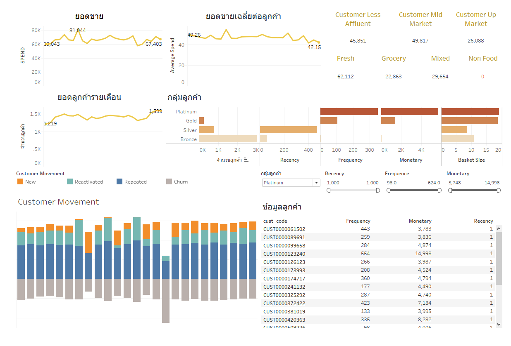

# Homework 05 - CLV Dashboard

## รายละเอียด
งานนี้ภาคต่อเนื่องของงาน Customer Segmentation และงาน Customer Movement Analysis โดยงานนี้จะนำข้อมูลที่ได้จากงานทั้ง 2 ดังกล่าว เพื่อที่จะแสดงผลเป็น Dashboard โดยเครื่องมือที่ใช้การสร้าง Dashboard คือTableau

## Dashboard ที่สร้างด้วย Tableau

## คำอธิบาย Dashboard
จาก Dashboard จะพบปัญหาคือว่าถึงแม้ว่าแนวโน้มของยอดขายและจำนวนลูกค้ารายเดือนจะสูงขึ้น แต่กลับพบว่ายอดขายเฉลี่ยต่อคนมีแนวโน้มที่จะลดลง ดังนั้นในอนาคตถึงแม้ว่าจะสามารถหาลูกต้าได้เพิ่มขึ้นแต่มีความเป็นไปได้ว่ารายได้อาจจะไม่แตกต่างไปจากปัจจุบันก็ได้

## ความเชื่อมโยง
- [x] [Homework 06 - Customer Segmentation](../Homework%2006%20-%20Customer%20Segmentation)

- [x] [Homework 10 - Customer Movement Analysis](../Homework%2010%20-%20Customer%20Movement%20Analysis)