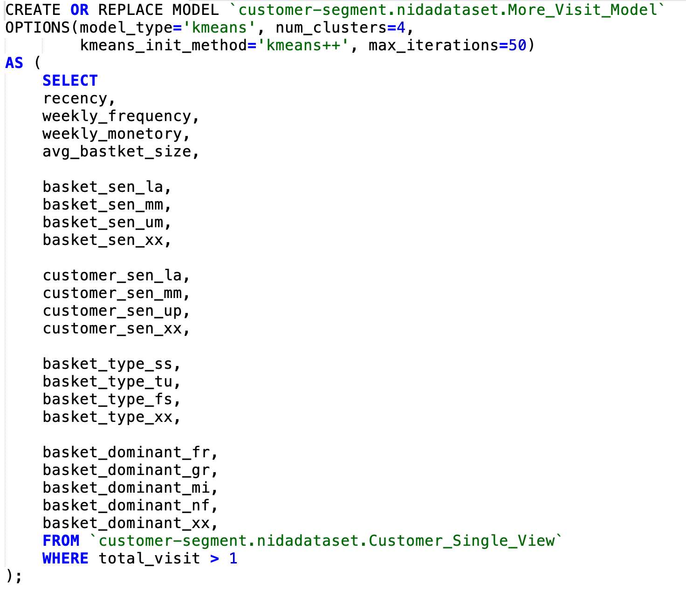

# Homework 06 - Customer Segmentation

## รายละเอียด
เป็นการนำเอาข้อมูลการซื้อสินค้าของลูกค้ามาทำการแบ่งกลุ่มโดยใช้ Tool อีกตัวหนึ่งคือ Google BigQuery ML

## ลักษณะของข้อมูลที่นำมาใช้ในการวิเคราะห์
ข้อมูลที่นำมาวิเคราะห์เป็นข้อมูลของ Dumhumby

- [x] [แหล่งข้อมูลของ Supermarket ที่นำใช้ในการวิเคราะห์](https://www.dunnhumby.com/source-files)

## Customer Single View
ข้อมูล Suppermarket จะถูกนำมาแปลงให้ข้อมูลมีลักษณะที่เรียกว่า Customer Single View ซึ่ง Customer Single View ก็คือรวมข้อมูลทุกอย่างของลูกค้าคนเดียวกันให้อยู่ใน 1 แถว ประโยชน์เพื่อง่ายต่อการวิเคราะห์ข้อมูล  
การสร้าง ​Customer Single View จะทำโดยใช้ภาษา ​​SQL และทำการประมวลผลโดยใช้ Google BigQuery สำหรับ Google BigQuery นั้นคือแพลตฟอร์มหนึ่งที่เหมาะสำหรับการวิเคราะห์ข้อมูลโดยเฉพาะที่มีปริมาณข้อมูลจำนวนมากๆ เพราะ Database ของ Google BigQuery จะมีคุณสมบัติเป็น Columnar Storage จึงทำให้การประมวลผลข้อมูลจำนวนมากๆ สามารถทำได้อย่างรวดเร็ว

​​SQL ที่ใช้ในการประมวลผลสร้าง Customer Single View เป็นดังนี้

## ลักษณะข้อมูล Customer Single View

## EDA ข้อมูล ​Customer Single View
เมื่อนำข้อมูลมาทำการจัดกลุ่มตามจำนวน Total Visit พบว่ามีลูกค้าจำนวนมากที่มี Total Visit เพียงแค่ 1 ครั้งเท่านั้น ดั่งนั้นจะทำแยกข้อมูลออกเป็น 2 ชุด คือ
- ชุดข้อมูลที่มี Total Visit เพียงแค่ครั้งเดียว และ
- ชุดข้อมูลที่มี Total Visit มากกว่า 1 ครั้ง  

## ทำการหาจำนวน ​Cluster ที่เหมาะสมของลูกค้าที่มี Total Visit เพียงแค่ 1 ครั้ง
พบว่าจำนวน ​Cluster ที่เหมาะสมคือ 4 กลุ่มแสดงดังรูป

## ทำการหาจำนวน ​Cluster ที่เหมาะสมของลูกค้าที่มี Total Visit มากกว่า 1 ครั้ง
พบว่าจำนวน ​Cluster ที่เหมาะสมคือ 4 กลุ่มเช่นกัน แสดงดังรูป

## ทำการแบ่งกลุ่มโดยใช้ Google BigQuery ML
script ที่ใช้ในการประมวลผลการแบ่งกลุ่มด้วย Google BigQuery ML แสดงดังรูป

## ผลลัพธ์ที่ได้จากการแบ่งกลุ่มของ More Visit Customer

## การตีความ

## ความเชื่อมโยง
ข้อมูลที่ได้จากการทำ Customer Segmentation จะถูกนำไปใช้ร่วมในงาน CLV Dashboard

- [x] [Homework 05 - CLV Dashboard](../Homework%2005%20-%20CLV%20Dashboard)

