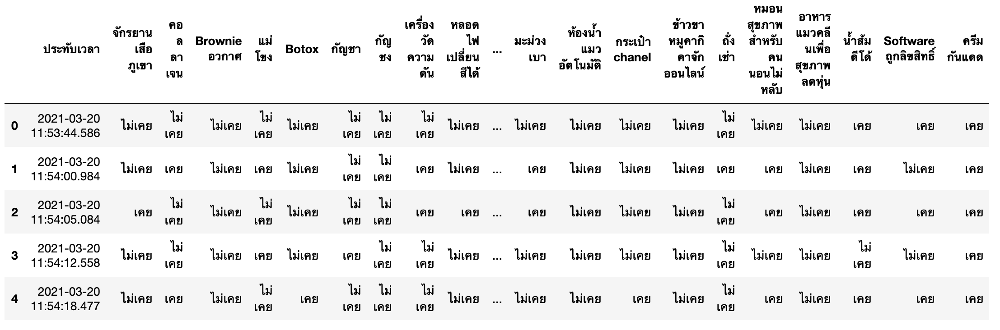
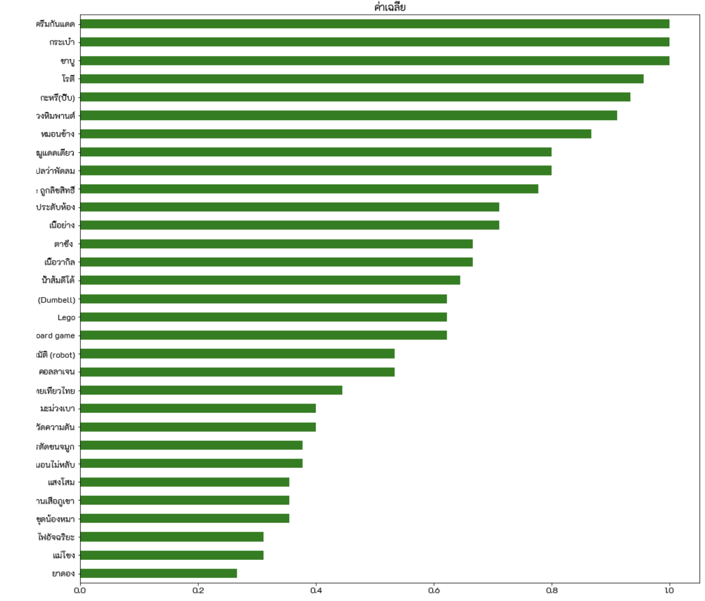
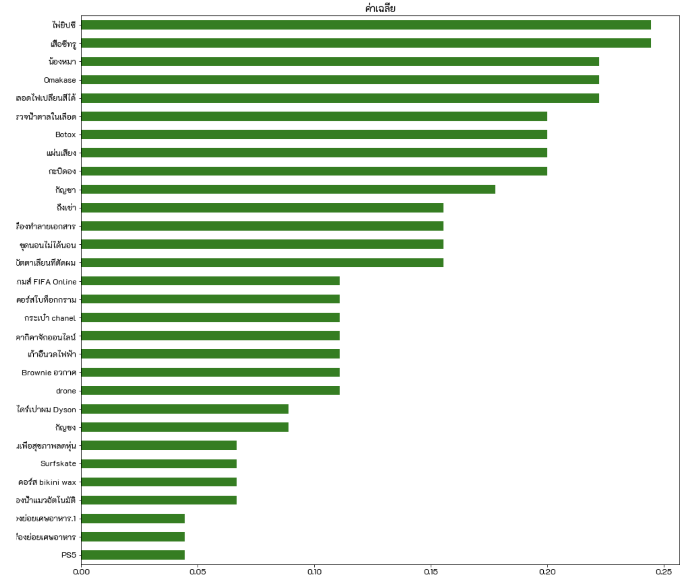
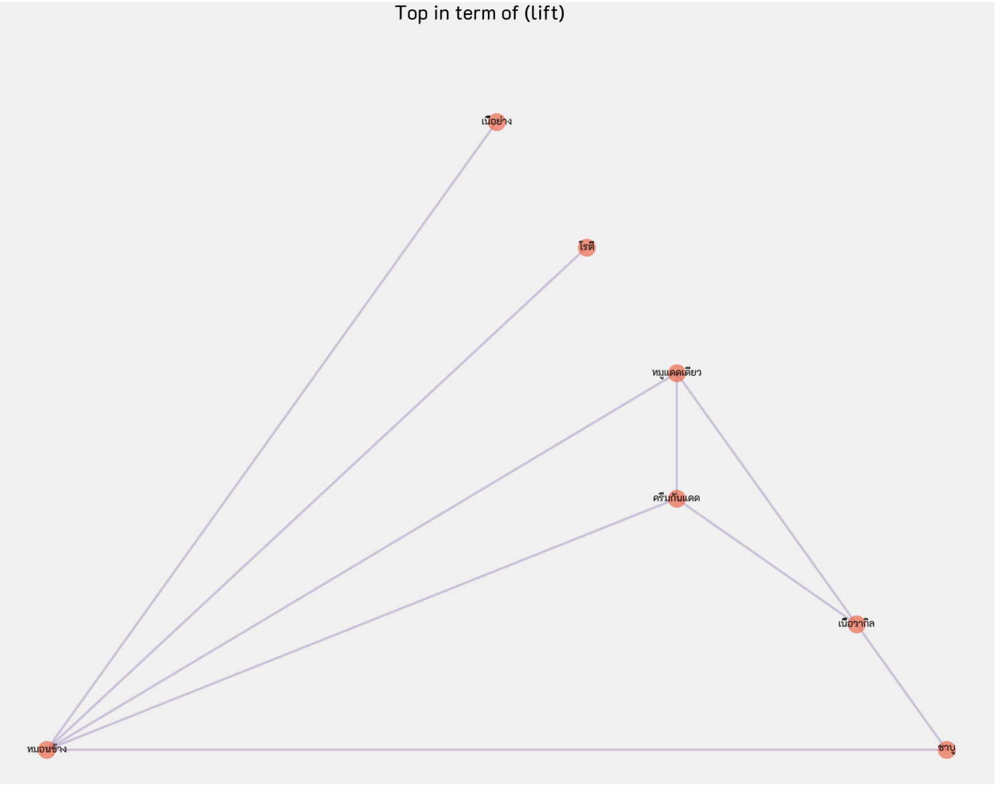

# Homework 07 - Product Recommendation

## รายละเอียด
งานนี้จะให้นักศึกษาในชั้นเรียนสร้างคำถามถามเพื่อนๆ ในชั้นเรียนโดยระบุชื่อสินค้าขึ้นมาคนละ 1 อย่างที่ตนเองเคยใช้ หรือเคยบริโภคเป็นต้น แล้วให้เพื่อนๆ ในชันเรียนตอบคำถามที่เพื่อนๆ ถามนั้นโดยคำตอบที่จะตอบได้มี 2 ทางเลือกคือ เคย และ ไม่เคย

จากนั้นให้นักศึกษานำข้อมูลที่ได้นี้ไปทำการวิเคราะห์หา Product Recommendation ให้กับเพื่อนๆ ในชั้น

## ลักษณะของข้อมูลที่นำมาใช้ในการวิเคราะห์

## ทำ EDA หาค่าเฉลี่ยของสินค้าแต่ละตัว

## ทำการวิเคราะห์ Market Basket Analysis
Market Basket Analysis เป็นการวิเคราะห์โดยการหาความสัมพันธ์ของข้อมูลเพื่อหารูปแบบที่เกิดขึ้นบ่อยๆ (Frequent Pattern) ผลที่ได้จากการหาคือกฎต่าง ที่เรียนกว่า Association Rule ซึ่งกฎนี้จะบอกเราว่าคนส่วนใหญ่นี้ใช้สิ่งของสิ่งนี้อยู่ ก็จะใช้สิ่งของอีกสิ่งหนึ่งด้วย ตัวอย่างเช่นถ้าลูกค้าซื้อผ้าอ้อมส่วนใหญ่ก็จะซื้อเบียร์ด้วย เป็นต้น

## ผลที่ได้จากการทำ Market Basket Analysid แสดงดังรูป

