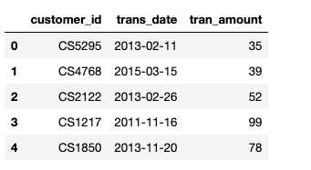
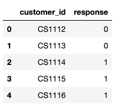
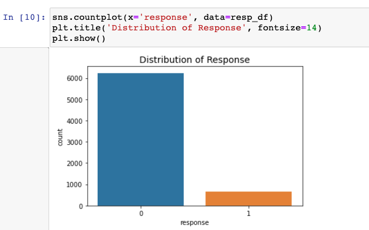
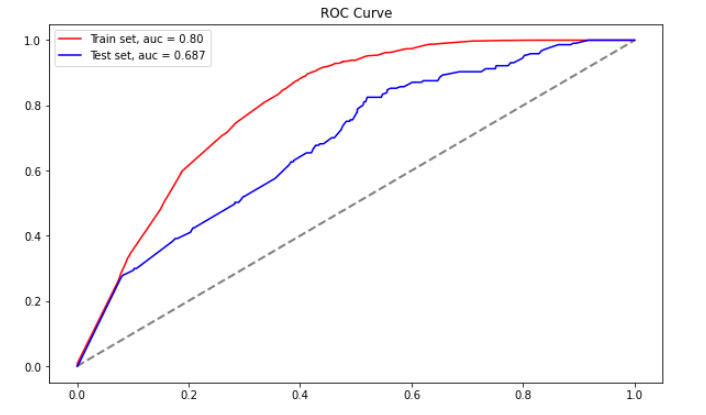
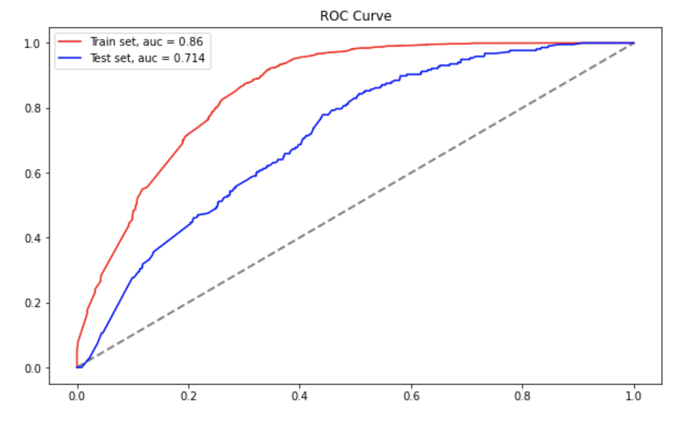
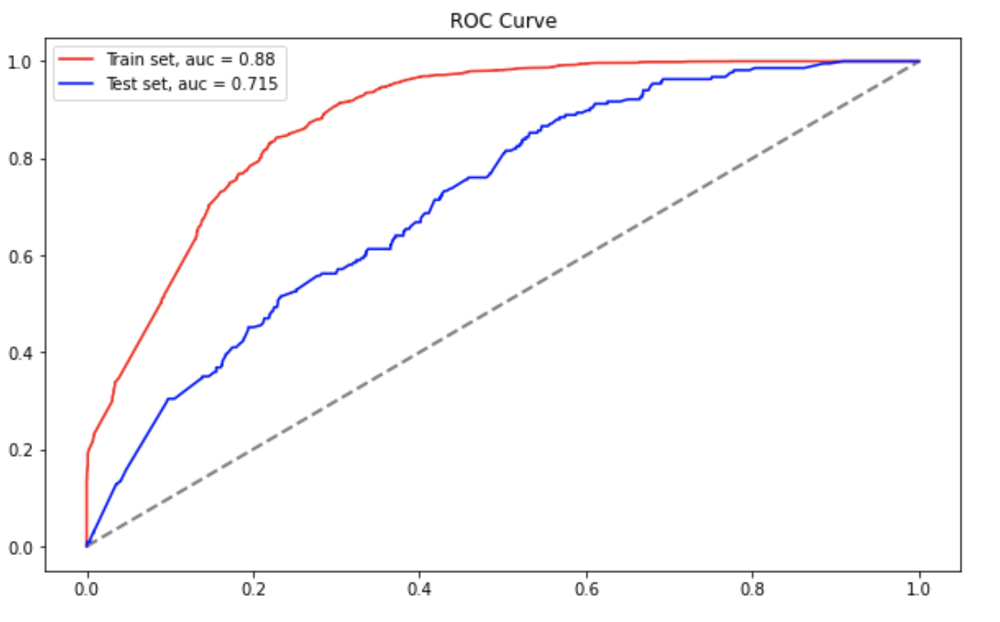

# Homework 08 - Campaign Response Model

## รายละเอียด
งานนี้จะเป็นการนำเอาข้อมูลการซื้อสินค้าในแต่ละครั้งของลูกค้า และข้อมูลการตอบรับ Campaign ของลูกค้ามาทำการสร้าง Model เพื่อที่จะทำนายว่าลูกค้าจะทำการตอบรับ Campaign ที่บริษัทมีการจัดส่งให้หรือไม่
ในการสร้าง Model จะใช้กระบวนการ Feature Engineering ซึ่งเป็นหา Feature ใหม่ๆ ขึ้นมาเพื่อช่วยทำให้ Model มีการเรียนรู้ได้ดีมากขึ้น โดย Feature ที่สร้างขึ้นมาใหม่นั้นจะใช้ความรู้เรื่อง RFM มาใช้

RFM คือ
ข้อมูลพฤติกรรมการซื้อสินค้าของลูกค้า 3 ปัจจัยคือ
1. Recency (R) : ลูกค้ามีการซื้อสินค้าครั้งล่าสุดนานแล้วแค่ไหน?
2. Frequency (F) : ลูกค้ามีการซื้อสินค้าบ่อยแค่ไหน?
3. Monetary (M) : มูลค่าในการซื้อสินค้่าเยอะมากแค่ไหน?

ประโยชน์ของ RFM คือ ถ้าลูกค้าพึ่งมาซื้อสินค้าได้ไม่นาน มีการซื้ออยู่เป็นประจำ และมีปริมาณการซื้อเยอะ ย่อมต้องมีโอกาศที่จะตอบรับ Campaign ที่เราส่งให้สูกว่านั่นเอง

นอกจากนี้ในงานนี้จะมีการแก้ปัญหาเรื่อง Imbalanced Dataset ซึ่งก็คือ Dataset ที่มีจำนวนข้อมูล Class ใด Class หนึ่งมากกว่าอีก Class หนึ่งมากๆ ซึ่งถ้าเราไม่จัดการปัญหา Imbalanced Dataset ก็จะทำให้ Model เรียนรู้ไม่ถูกต้องและจะถูกชักนำให้ไปทำนาย Class ที่มีจำนวนมากสูงกว่า Class ที่มีจำนวนน้อย
ในงานนี้จะเลือกใช้ SMOTE มาช่วยในการจัดการโดย SMOTE เป็นวิธีการที่เรียกว่า Oversampling ซึ่งก็คือจะไปทำการ Random เพิ่มปริมาณจำนวนข้อมูลของ Class ที่มีปริมาณน้อยให้มากขึ้น

## วิดีโออธิบายการทำงานของ Campaign Response Model
ได้มีการทำวิดีโอเพิ่มอธิบายรายละเอียดการสร้าง ​Campaign Response Model ไว้ สามารถเข้าไปดูวิดีโอได้ที่ลิงค์ข้างล่าง

## 1. ลักษณะของข้อมูลที่ใช้ในการสร้าง Model
ข้อมูลที่นำมาใช้ในการสร้างโมเดลจะมีด้วยกัน 2 ชุดดังนี้
1. เป็นข้อมูลการซื้อสินค้าของลูกค้า

2. เป็นข้อมูลการตอบรับเคมเปญของลูกค้า

เมื่อนำข้อมูลในชุดที่ 2 มา EDA เพื่อดูลักษณะการตอบรับเคมเปญของลูกค้าก็จะพบว่าข้อมูลมีลักษณะของข้อมูลเป็นแบบ Imbalanced Dataset เนื่องจากมีจำนวนข้อมูลที่ระบุว่าไม่ตอบรับ Campaign (0) สูงกว่าจำนวนข้อมูลที่ระบุว่าตอบรับ Campaign ดังนั้นเพื่อไม่ให้ผลการเรียนรู้ของโมเดลถูกโน้มน้าวไปทางไม่ตอบรับ Campaign จึงจำเป็นจะต้องมีการจัดการปัญหา Imbalanced Dataset เหล่านี้ซึ่งในงานนี้จะแก้ปัญหาโดยใช้ ​SMOTE ลักษณะของข้อมูล ​Imabalanced Dataset แสดงดังรูป

## 2. การทำนายครั้งแรก
ในการ Model แรก ใช้ข้อมูล 3 recency, total frequency และ total monetary ผลที่ได้แสดงดู

## 3. การทำนายครั้งที่ 2
การใช้ค่า total frequency และ total monetary อาจทำให้ผลการวิเคราะห์นั้นผิดเพี้ยงไปได้ ตัวอย่างเช่น ถ้ามีลูกค้าท่านหนึ่งพึ่งมาเป็นลูกค้าได้ 5 วัน และลูกค้าท่านนี้เข้ามาซื้อสินค้าทุกวัน เมื่อเทียบกับลูกค้าอีกท่านหนึ่งเป็นลูกค้าตั้งแต่ 3 ปีที่แล้วและเข้ามาซื้อสินค้าได้ 7 ครั้ง จะเห็นว่าถ้าเราใช้ Total Frequency จะตีความว่าลูกค้าคนที่ 2 มี Value มากกว่าทั้งๆ ที่ความเป็นจริงลูกค้าคนแรกควรจะมี Value มากกว่า ดังนั้นจึงควรใช้ค่าเฉลี่ยเช่นรายเดือนหรือรายสัปดาห์เป็นต้น
ในการทำนายครั้งที่ 2 จะใข้ ​Feature average frequency และ average monetary แทน ซึ่งพบว่าผลที่ได้ในการทำนายครั้งที่ 2 มีค่าสูงขึ้นดังแสดงในภาพข้างล่างซึ่งพบว่าได้ค่า AUC เพิ่มจาก 0.68 เป็น 0.71 ดังแสดงในรูปข้างล่าง

## 4. การทำนายครั้งที่ 3
ได้ทำการปรับปรุงโดยนำค่า recency frequency และmonetary มาทำการแบ่งเป็นกลุ่ม 5 กลุ่มโดยใช้ช่วงข้อมูล ผลที่ได้พบว่าได้ผลการทำนายดีขึ้นซึ่งแสดงดังรูป

## 5. การปรับปรุงในครั้งต่อไป
สิ่งที่วางแผนจะทำเพิ่มในอนาคตคือตัดช่วงข้อมูลให้ย้อนหลังแค่เพียง 1 ปี ทั้งนี้เพราะตามหลังความจริงแล้วการทำ Campaign Response ไม่ควรใช้ข้อมูลที่นานเกินไป
