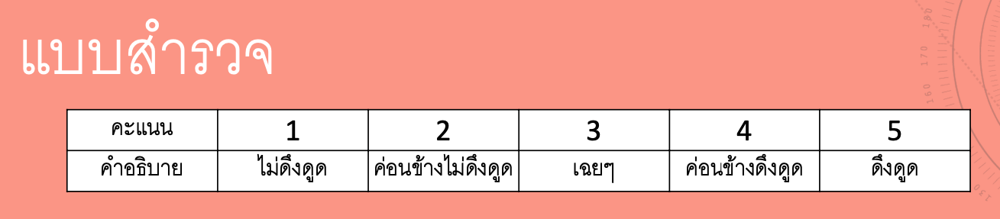
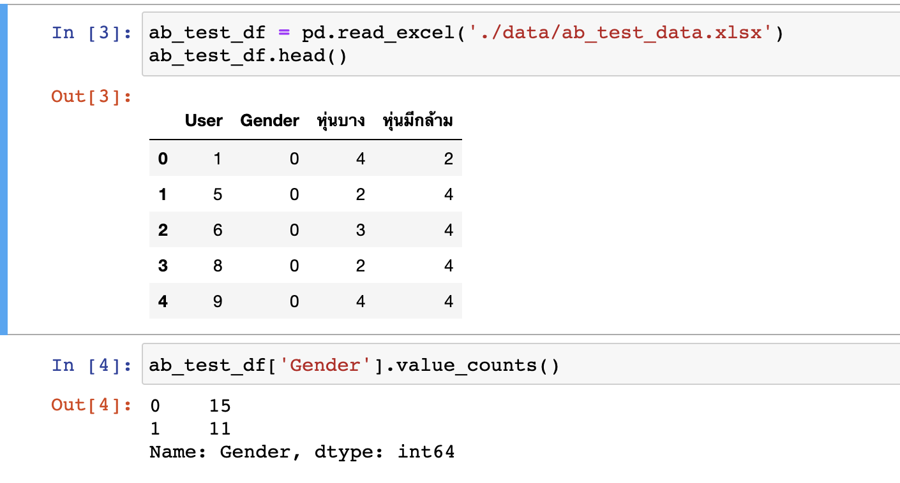
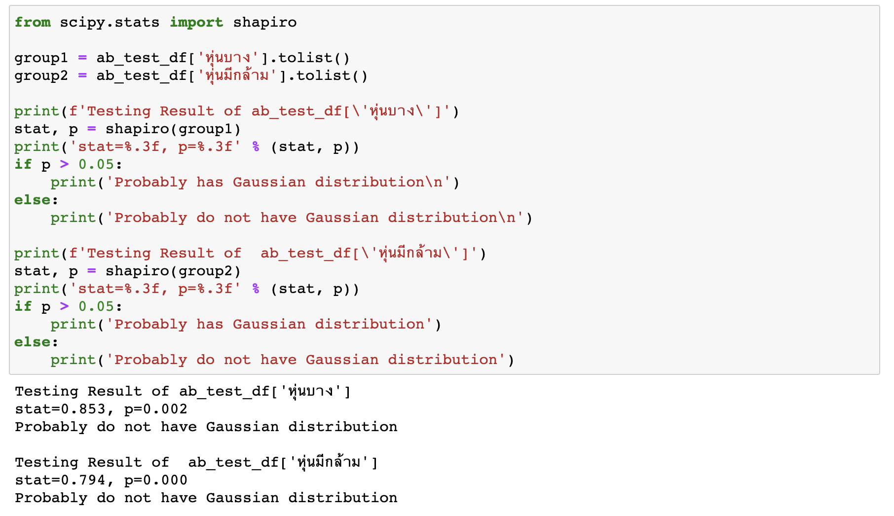
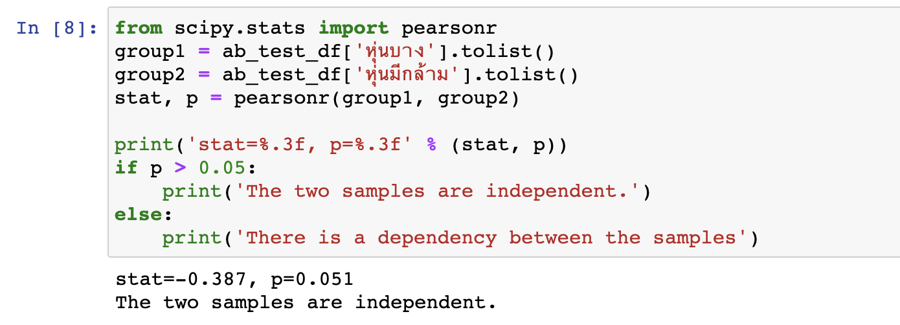
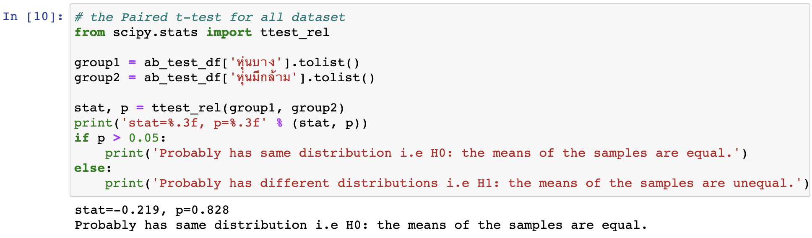
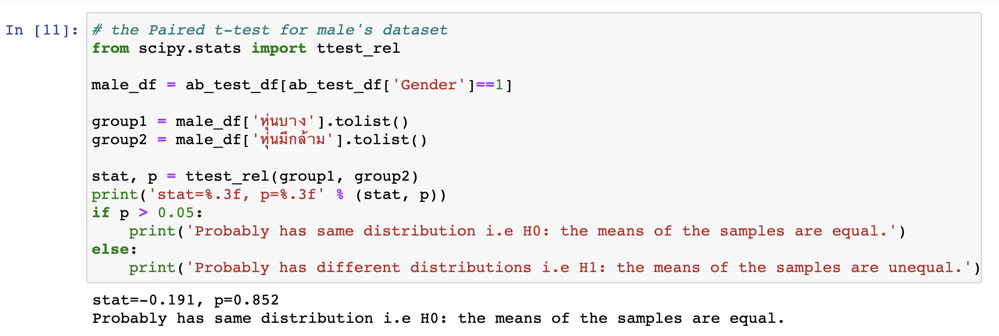
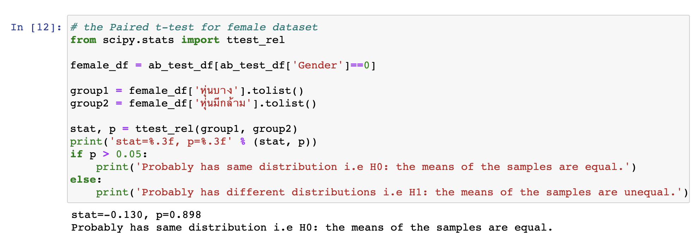

# Homework 09 - AB Testing

## รายละเอียด
เป็นเครื่องมืออันหนึ่งที่นิยมใช้กันมากทางการตลาด วิธีการทำคือจะทำการทดสอบโดยการแบ่งกลุ่มผู้ทดสอบออกเป็น 2 กลุ่มประมาณเท่าๆ กัน แล้วให้ผู้ทดสอบกลุ่มแรกเห็นแบบ A และผู้ทดสอบกลุ่มที่ 2 เห็นแบบ B จากนั้นก็นำผลการทดสอบของทั้ง 2 กลุ่มมาทำการวัดผลตามสมมติฐาน (Hypothesis) ที่เราตั้งไว้ตั้งแต่เริ่มต้น ว่าผลการทดสอบที่ได้นั้นทำให้เรายอมรับสมมุติฐาฯที่เราตั้งไว้ หรือปฎิเสธสมมุติฐานที่เราตั้งไว้

ตัวอย่างเช่น เราไปทำการวิจัยมาแล้วพบว่า

"ถ้ามีคำอธิบายอยู่ปุ่มกดสั่งซื้อสินค้า จะทำให้มีการซื้อสินค้ามากขึ้น"

เราก็นำความรู้สิ่งนี้มาตั้งเป็นสมมุติฐานแล้วทำการทดสอบว่าสมมุติฐานนี้เราจะยอมรับสมมุติฐานนี้หรือไม่ ในการทดลองเพื่อทดสอบผลก็ทำโดยจัดทำแบบสอบถามกับกลุ่มทดสอบ 2 กลุ่ม กลุ่มหนึ่งเห็นหน้าจอที่คำอธิบายข้างๆ ปุ่ม อีกกลุ่มหนึ่งเห็นหน้าจอที่ไม่มีคำอธิบายข้างๆ ปุ่มแล้ว แล้วนำผลการสอบถามมาพิสูทธิ์ด้วยวิธีการทางสถิติ

กิจกรรมสำหรับในงานนี้คือให้มีการแบ่งกลุ่มในห้อง แต่ละกลุ่มตั้งสมมุติฐานที่จะทดสอบด้วย A/B Testing จากนั้นให้ทำแบบสอบถามด้วย Google Sheet เพื่อสอบถามเพื่อนๆ ที่รู้จักแล้วนำผลที่สรุปได้มาถกกันในห้อง

ในงานกลุ่มจะทำแบบสอบถามเพื่อนว่า 
"ผู้หญิงหุ่นแบบไหนจะมีความดึงดูดมากกว่ากันระหว่างผู้หญิงหุ่นบางและผู้หญิงหุ่นมีกล้าม" 
ลักษณะของคำถามแสดงดังรูป

โดยให้ตอบคำถามในเป็นแบบ Likert scale 1-5 ซึ่งแต่ละค่ามีความหมายดังรูป

ผลที่ได้จะนำไปวิเคราะห์ค่าทางสถิติโดยใช้ Library ของ Python ซึ่งสรุปได้ดังนี้

## ลักษณะของข้อมูลที่ได้จากการทำแบบสอบถาม

## ทดสอบ Normality Test
เนื่องจากจะทำการทดสอบสมมุติฐานโดยใช้ Paired t-test ซึ่งจะทำได้ข้อมูลต้องมีคุณลักษณะ 2 อย่างคือมีการกระจายตัวเป็นแบบ Gaussian Distribution และข้อมูลเป็น iid หรือการกระจายตัวมีความเป็นอิสระต่อกัน ซึ่งผลการทำสอบ Normality Test พบว่าผลที่ได้คือการกระจายตัวไม่เป็น Gaussian Distribution

## ทดสอบ Correlation Test ด้วย Pearson's Correlation Coefficient
พบว่ากลุ่มตัวยอย่างทั้ง 2 กลุ่มมีความเป็นอิสระต่อกัน

## ผลการทดสอบ A/B Testing
ในการทำแบบสอบถามนี้จะออกแบบเพื่อตอบสมมุติฐานที่ตั้งไว้ 3 หัวข้อคือ
1. ตั้งสมมุติฐานไว้ดังนี้
H0 : ทั้งผู้ชายและผู้หญิงมองว่าผู้หญิงหุ่นบางและผู้หญิงหุ่นมีกล้ามมีความดึงดูดไม่แตกต่างกัน
H1 : ทั้งผู้ชายและผู้หญิงมองว่าผู้หญิงหุ่นบางและผู้หญิงหุ่นมีกล้ามมีความดึงดูดแตกต่างกัน

2. ตั้งสมมุติฐานไว้ดังนี้
H0 : กลุ่มผู้ชายมองว่าผู้หญิงหุ่นบางและผู้หญิงหุ่นมีกล้ามมีความดึงดูดไม่แตกต่างกัน
H1 : กลุ่มผู้ชายมองว่าผู้หญิงหุ่นบางและผู้หญิงหุ่นมีกล้ามมีความดึงดูดแตกต่างกัน

3. ตั้งสมมุติฐานไว้ดังนี้
H0 : กลุ่มผู้หญิงมองว่าผู้หญิงหุ่นบางและผู้หญิงหุ่นมีกล้ามมีความดึงดูดไม่แตกต่างกัน
H1 : กลุ่มผู้หญิงมองว่าผู้หญิงหุ่นบางและผู้หญิงหุ่นมีกล้ามมีความดึงดูดแตกต่างกัน

## ผลการทำ Paired t-test ของทั้งผู้ชายและผู้ญิง
ผลที่ได้สรุปว่ายอมรับ H0 นั่นคือทั้งผู้ชายและผู้หญิงมองว่าผู้หญิงหุ่นบางและผู้หญิงหุ่นมีกล้ามมีความดึงดูดไม่แตกต่างกัน ที่ระดับความเชื่อมั่น 95%

## ผลการทำ Paired t-test ของกลุ่มผู้ชาย
ผลที่ได้สรุปว่ายอมรับ H0 นั่นคือกลุ่มผู้ชายมองว่าผู้หญิงหุ่นบางและผู้หญิงหุ่นมีกล้ามมีความดึงดูดไม่แตกต่างกัน ที่ระดับความเชื่อมั่น 95%

## ผลการทำ Paired t-test ของกลุ่มผู้หญิง
ผลที่ได้สรุปว่ายอมรับ H0 นั่นคือกลุ่มผู้หญิงก็มองว่าผู้หญิงหุ่นบางและผู้หญิงหุ่นมีกล้ามมีความดึงดูดไม่แตกต่างกัน ที่ระดับความเชื่อมั่น 95%
