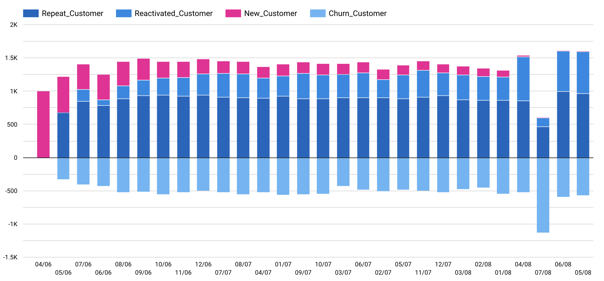

# Homework 10 - Customer Movement Analysis

## รายละเอียด
เป็นการนำเอาข้อมูลการซื้อสินค้าของลูกค้ามาจัดแบ่งลูกค้าออกเป็น 4 กลุ่มคือ
1. New Customer คือ กลุ่มลูกค้าใหม่ นั่นคือเป็นกลุ่มลูกค้าที่มีการซื้อสินค้าในเดือนปัจจุบัน แต่ไม่เคยซื้อสินค้าในเดือนก่อนหน้านั้นมาก่อน
2. Repeat Customer คือ กลุ่มลูกค้าขาประจำ นั่นคือกลุ่มลูกค้าที่มีการสินค้าในเดือนที่แล้ว และกลับมาซื้อสินค้าอีกในเดือนปัจจุบัน
3. ​Reactivated Customer คือ กลุ่มลูกค้าขาจร นั่นคือกลุ่มลูกค้าที่เคยมาซื้อสินค้าในอดีตแต่ เดือนที่แล้วเขาไม่ได้มาซื้อสินค้า พึ่งจะกลับมาซื้อสินค้าในเดือนปัจจุบัน
4. Churn Customer คือ กลุ่มที่ไม่ได้เป็นลูกค้ากับเราในเดือนนี้ นั่นคือกลุ่มลูกค้าที่เคยซื้อสินค้ากับเราในอดีตแต่เดือนปัจจุบันไม่ได้เข้ามาซื้อสินค้ากับเรา

- [x] [แหล่งข้อมูลของ Supermarket ที่นำใช้ในการวิเคราะห์](https://www.dunnhumby.com/source-files)

## ผลลัพธ์ของการทำ Customer Movement Analysis
แสดงดังรูปข้างล่าง

## ความเชื่อมโยง
ข้อมูลที่ได้จากการทำ Customer Movement Analysis จะถูกนำไปใช้ร่วมในงาน CLV Dashboard
- [x] [Homework 05 - CLV Dashboard](../Homework%2005%20-%20CLV%20Dashboard)