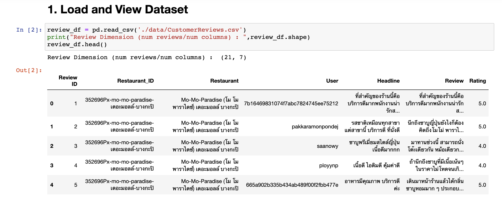
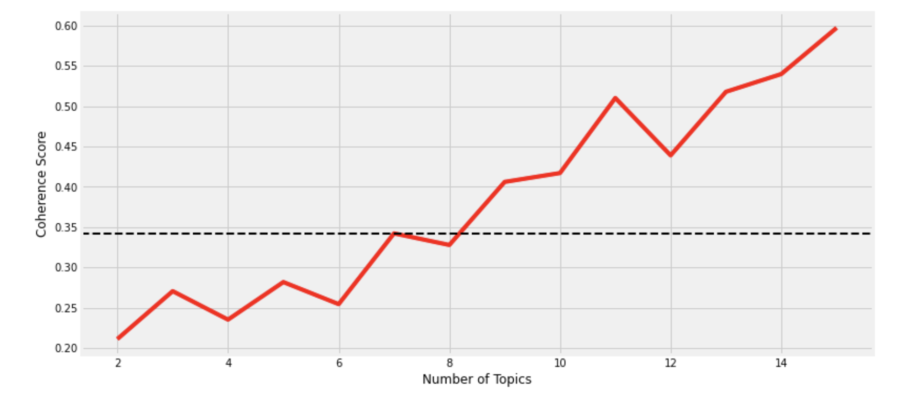
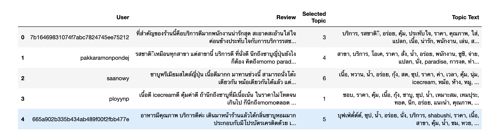

# Homework 11 - Voice of Customer

## รายละเอียด
งานนี้จะเป็นการวิเคราะห์ความคิดเห็นของผู้ใช้บริการที่มีต่อร้านหนึ่งๆ ซึ่งเก็บอยู่ในรูปแบบของข้อความ
แล้วนำมาวิเคราะห์เพื่อหาข้อความที่สรุปว่าความคิดเห็นของผุ้ใช้คนนั้นๆ ว่ามีเนื้อหาเกี่ยวกับเรื่องใด
งานนี้จะทำการวิเคราะห์โดยใช้เทคนิคทางด้าน NLP (Natural Language Processing)
ที่เรียกว่าการทำ Topic Modeling

## ลักษณะของข้อมูลเริ่มต้นที่นำมาใช้ในการวิเคราะห์

## ทำการหาว่าจะเลือกจำนวน Topic กี่ Topic ถึงจะเหมาะสมที่สุด
จากกราฟแสดงให้เห็นว่าสามารถเลือกจำนวน Topic ได้มากกว่า 7 แต่ในงานนี้จะเลือกเพี่ยงแค่ 7 topic เพื่อไม่ให้มีจำนวน Topic มากจนเกือบเท่ากับจำนวนความคิดเห็นที่มีอยู่ใน Dataset ที่นำมาวิเคราะห์

## แสดงผล Topic ที่ได้
ผลข้างล่างจะแสดงการเปรียบเทียบว่า Topic ที่ได้จากการวิเคราะห์ เมื่อนำมาเทียบคู่กับข้อความแสดงคิดเห็นของแต่ละผู้ใช้ มีความแตกต่างกันหรือว่าคล้ายคลึงกันหรือไม่ ซึ่งรูปพบว่า Topic ที่หาได้มีความหมายใกล้เคียงกับความคิดเห็นของผู้ใช้
