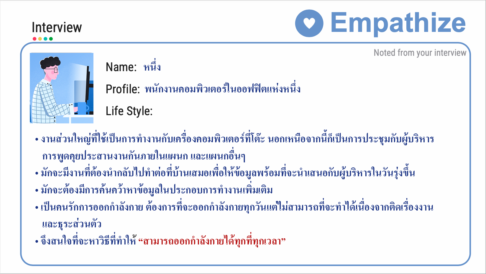
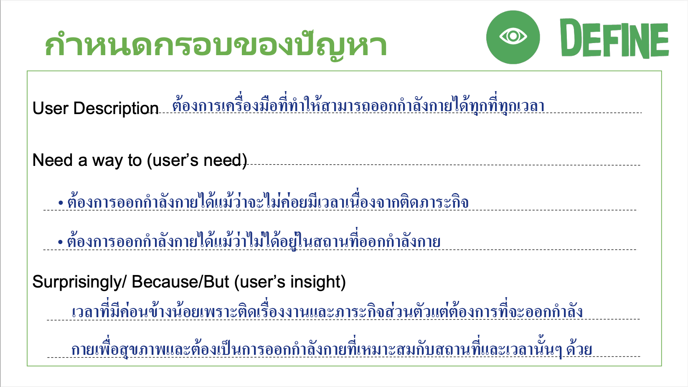
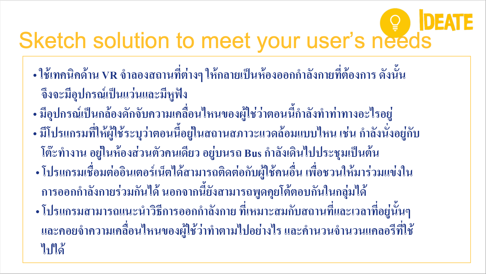
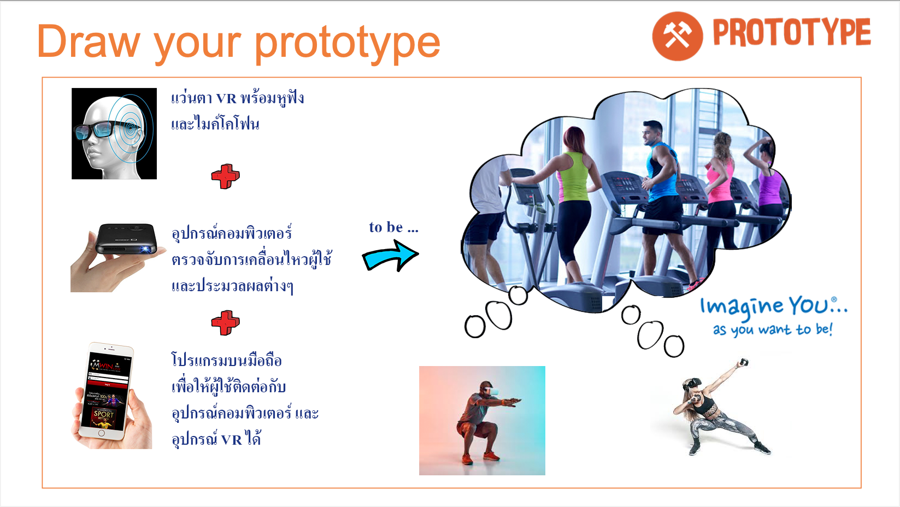
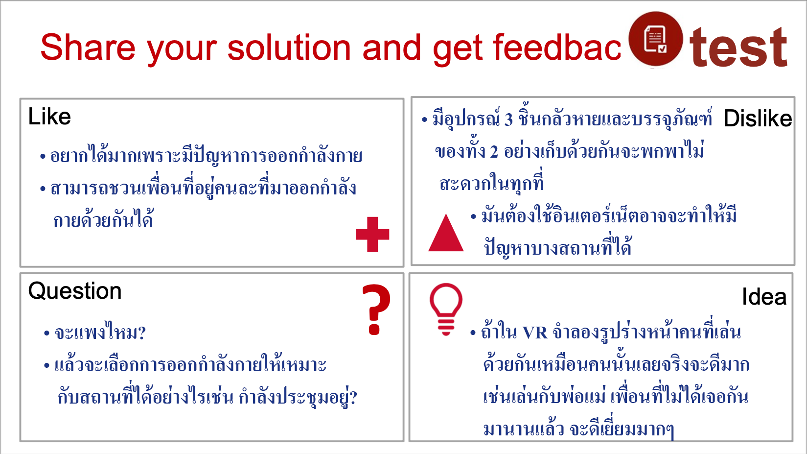

# Homework 12 - Design Thinking

## รายละเอียด
Design Thinking เป็นกระบวนการหนึ่งที่คนสนใจกันมากในช่วงนี้ เป็นกระบวนการที่คิดวิเคราะห์สิ่งที่เกิดขึ้นเช่น สินค้าหรือปัญหาเป็นต้น กระบวนการนี้จะทำให้เราระดมมันสมองช่วยกันวิเคราะห์ โดยมีหลักสำคัญอันหนึ่งคือห้ามตำหนิความคิดของคนใดคนหนึ่ง เพื่อให้ทุกคนกล้าคิดกล้าบอก และนำไปสู่การวิเคราห์ถึงสาเหตุของปัญหา หรือค้นพบว่า Feature ใหม่ๆ ของผลิตภัณฑ์ที่เราต้องการได้  กระบวนการของ Design Thinking ประกอบด้วย 5 ขั้นตอนย่อยๆ คือ

1. Empathize – เป็นการทำความเข้าใจในปัญหา
2. Define – กำหนดปัญหาที่เกิดขึ้นให้มีความชัดเจนมากขึ้น
3. Ideate – ทำการช่วยกันระดมความคิด
4. Prototype – นำความคิดเหล่านั้นมาสร้างเป็นตัวต้นแบบ
5. Test – นำสิ่งที่เราคิดไปทำการทดสอบกับคนอื่นแล้วรับความคิดเห็นกลับมาพัฒนาเพิ่มเติม

สำหรับในงานนี้ได้ออกแบบทำให้เป็นภาคต่อจาก 2 งานก่อนหน้านั้นโดยก่อนหน้านั้นเริ่มมาว่าสิ่งที่ต้องการทำให้สำเร็จคืออะไร แล้วตามด้วยว่าที่ต้องการทำนั้น มี Pain และ ​Gain อย่างไร จนมาจบที่งานนี้เพื่อใช้หลักการของ Design Thinking สร้างต้องแบบของผลิตภัณฑ์ที่ทำให้เราได้ Gain และลด Pain นั้นได้อย่างไรด้วยกระบวนการของ Design Thinking

## 1. ขั้นตอนการ Empathize แสดงดังรูป

## 2. ขั้นตอนการ Define แสดงดังรูป

## 3. ขั้นตอนการ Ideate แสดงดังรูป

## 4. ขั้นตอนการ Prototype แสดงดังรูป

## 5. ขั้นตอนการ Test แสดงดังรูป

## งานนี้เชื่อมโยงกับ 2 งานข้างต้นคือ
- [x] [Homework 02 - Jobs to be done](../Homework%2002%20-%20Jobs%20to%20be%20done)

- [x] [Homework 03 - Value Proposition](../Homework%2003%20-%20Value%20Proposition)